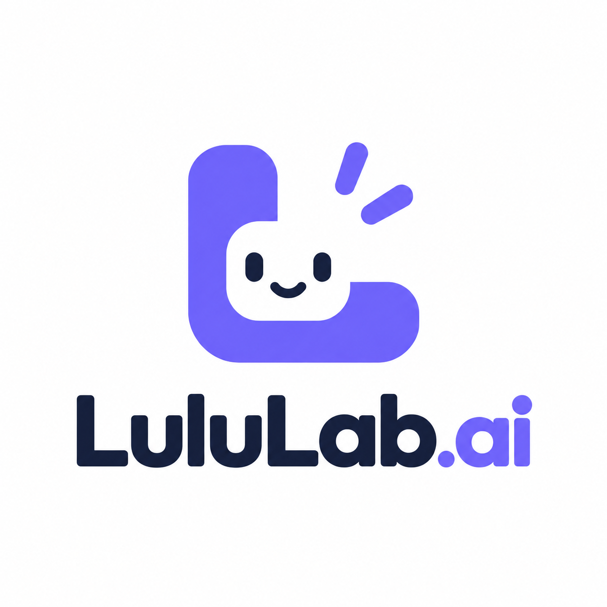

# LuluLab.AI · Video Marketing Skills

Created and maintained by **LuluLab.AI**.

AI agent skills for creating, analyzing, and automating short-form marketing videos.

Designed for:

- TikTok Ads
- UGC Marketing Videos
- E-commerce Creatives
- AI Video Generation Workflows

## Included Skills

### 复刻爆款视频 (`recreate-video-agent`)

AI agent system for analyzing and recreating viral short videos.

Current workflow: **V5.1 Identity Bindings**; SkillHub package version: **1.1.5**. Analysis, image editing, and video generation use LuluLab CLI: RecreateVideoPromptV3, ImageGenV2 (`gpt-image-2-5-sunburst`, 1K), and VideoGenV2 (Seedance2 Mini, 720p). Each segment uses one 3×3 source-frame storyboard and supports product and creator replacement, task recovery, and duplicate-submission protection.

See the [installation and usage guide](skills/recreate-video-agent/README.md) and [skill instructions](skills/recreate-video-agent/SKILL.md). Requires a LuluLab API key, Python 3, FFmpeg, and FFprobe. The package includes LuluLab CLI for macOS arm64 and Windows x64; workflows are triggered by the CLI.

Capabilities:

- Analyze viral short videos
- Extract video structure and marketing logic
- Identify creators, products, and scenes
- Generate structured AI video prompts
- Maintain creator consistency across segments

### ugc-product-video

AI agent skill for creating UGC product marketing videos.

Capabilities:

- Generate product-focused video workflows
- Create AI marketing video prompts
- Automate UGC video production

## Workflow

Video Input

↓

AI Video Analysis

↓

Structured Video Assets

↓

Prompt Generation

↓

AI Video Generation

## Supported Models

- Seedance
- Google Veo
- Google Omni
- Other AI video models

## Example

Input:

A viral product advertisement video

Output:

- Scene breakdown
- Creator profile
- Product analysis
- AI generation prompts
- AI video production workflow

## Roadmap

- [x] Video analysis framework
- [x] Structured prompt generation
- [ ] Web interface
- [ ] Multi-agent workflow
- [ ] More AI video model integrations

## Commercial Version

For production-scale AI marketing video creation:

**LuluLab**

---

# LuluLab.AI · 视频营销技能

由 **LuluLab.AI** 开发与维护，用于创建、分析和自动化短视频营销内容的 AI Agent Skill 集合。

适用于：

- TikTok 广告
- UGC 带货视频
- 电商营销素材
- AI 视频生产流程

## 包含 Skill

### 复刻爆款视频 (`recreate-video-agent`)

用于爆款短视频分析与复刻的 AI Agent 系统。

当前工作流：**V5.1 Identity Bindings**；SkillHub 包版本：**1.1.5**。拆解、图片编辑和视频生成统一使用 LuluLab CLI：RecreateVideoPromptV3、ImageGenV2（`gpt-image-2-5-sunburst`，1K）和 VideoGenV2（Seedance2 Mini，720p）。每段使用一张 3×3 真实帧 Storyboard，支持商品与达人替换、任务恢复和防重复提交。

查看[安装与使用说明](skills/recreate-video-agent/README.md)和[完整技能规则](skills/recreate-video-agent/SKILL.md)。需要 LuluLab API Key、Python 3、FFmpeg 和 FFprobe；包内置 macOS arm64 与 Windows x64 的 LuluLab CLI，工作流由 CLI 自动触发。

核心能力：

- 分析爆款短视频
- 提取视频结构和营销逻辑
- 识别人物、产品和场景
- 生成结构化 AI 视频提示词
- 保持多 Segment 视频人物一致性

### ugc-product-video

用于生成 UGC 商品营销视频的 AI Agent Skill。

核心能力：

- 商品视频生成流程
- UGC 视频创意生成
- AI 营销视频自动化生产

## 工作流程

视频输入

↓

AI 视频分析

↓

结构化视频资产

↓

提示词生成

↓

AI 视频生成

## 支持模型

- Seedance
- Google Veo
- Google Omni
- 其他 AI 视频模型

## 示例

输入：

一个爆款电商产品广告视频

输出：

- 视频场景拆解
- 人物角色分析
- 产品信息分析
- AI 视频生成提示词
- 视频生产方案

## Roadmap

- [x] 视频分析框架
- [x] 结构化提示词生成
- [ ] Web 界面
- [ ] Multi-Agent 工作流
- [ ] 更多 AI 视频模型支持

## 商业版本

面向企业和商业场景的 AI 营销视频生产平台：

**LuluLab**
